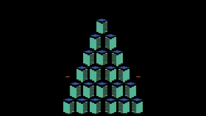
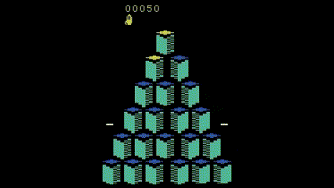
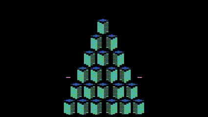
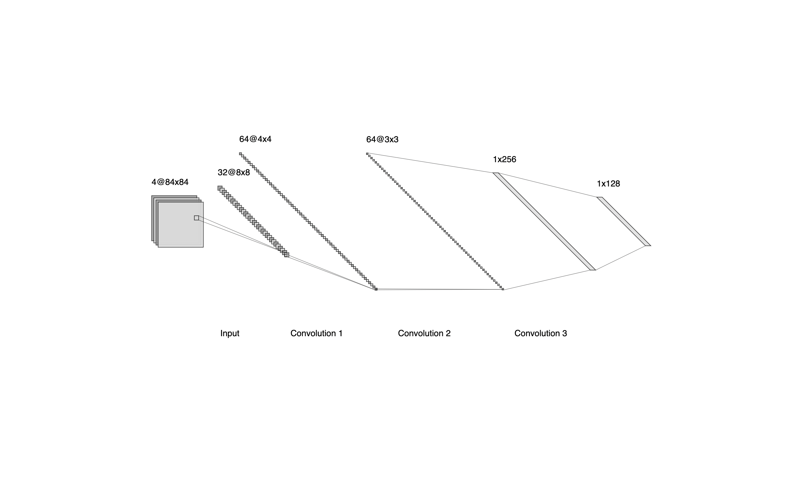
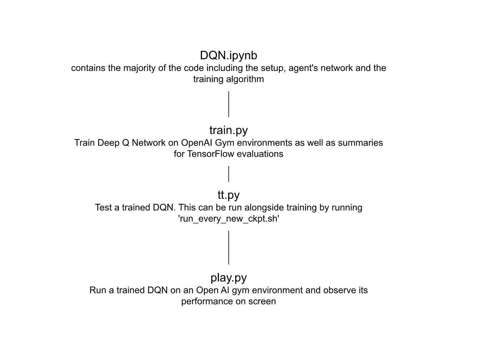

# 2022-t5-deep-q-learning: Deep Q-Network Model with Atari Games

Reinforcement learning is an area of machine learning that is focused on training agents to take certain actions at certain states in an environment to maximize rewards.
DQN is a reinforcement learning algorithm where a deep learning model is built to find the actions an agent can take at each state. This project trains a DQN model to play a variety of Atari Games, including Q\*bert. It includes a random agent, which generates gameplay based on the machine making random actions, as well as a trained model that attempts to make desired actions to win the game. 

## Demo App
[This is a link to a Google Colab Notebook with the code for this repository](https://colab.research.google.com/drive/1ytTTBTJVBIkCO1YBOC7O50e3x_ECDtNc?usp=sharing)

## Videos
### Process Video Showing How to Use Our Product

### Gifs of the various models
#### Random Agent

#### Trained

#### Attempted Optimization and Edits

## Architectures
### Model Architecture

### System Architecture

